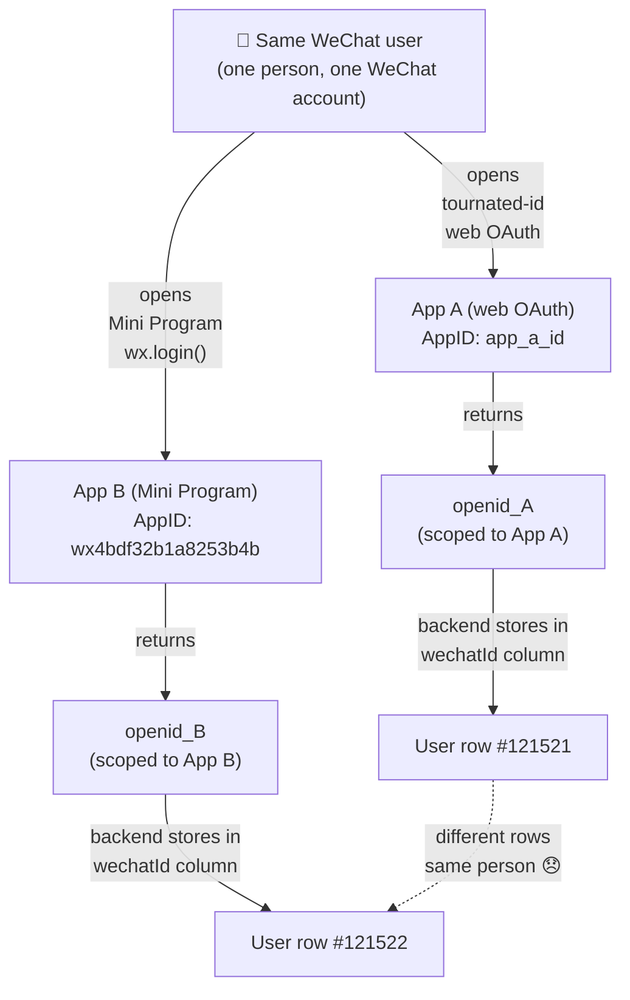
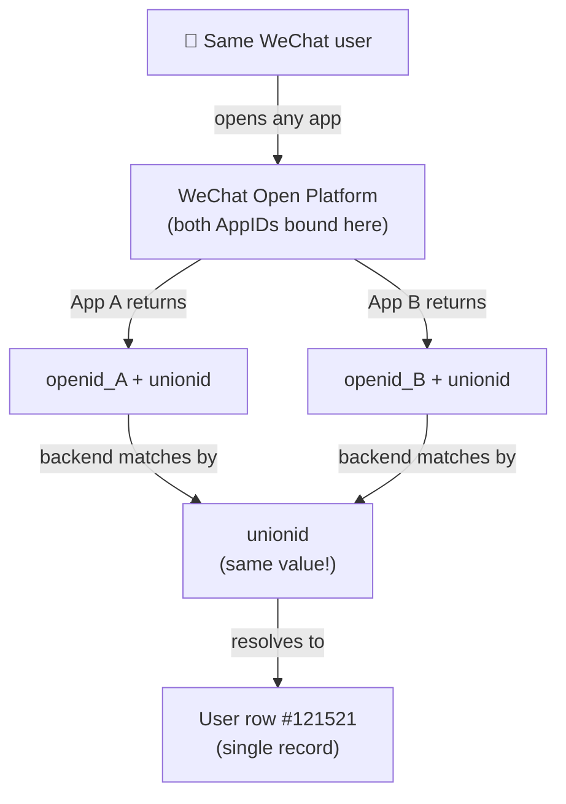
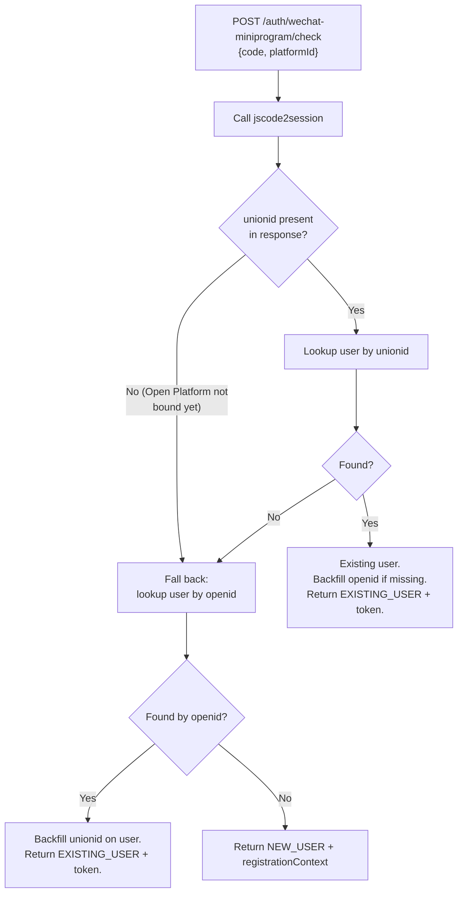

# WeChat Identity — Why users get separate accounts across apps

> **TL;DR.** Our WeChat Mini Program (`wx.login()`) and tournated-id (web OAuth) currently create **two separate user accounts** for the same WeChat user. Reason: we identify by `openid`, which is **different per WeChat AppID**. Fix: link both apps to the same **WeChat Open Platform** account so both APIs return the same **`unionid`**, then have the backend match users by `unionid`.

---

## 1. The three WeChat identifiers — what they mean

WeChat APIs return up to three IDs:

| ID | Scope | Stable across apps? | What we use it for |
|----|-------|---------------------|--------------------|
| **`openid`** | Unique per WeChat App (per AppID) | ❌ Different per AppID | Required for `wx.requestPayment()` inside the mini program. Currently our `wechatId` column. |
| **`unionid`** | Unique per WeChat Open Platform account | ✅ Same across all apps under that Open Platform | This is what we need to match users across apps. |
| **`session_key`** | Session-scoped, used for decrypting user data | ❌ Ephemeral, not for identity | Decryption only. Don't store. |

The critical point: **`openid` is scoped to a single AppID.** Two WeChat apps (e.g. our mini program and our web OAuth app) see the **same WeChat user as two different `openid`s**.

---

## 2. The bug, visualized

### Today (broken)



One person → two user rows. Tournament history, registrations, payments — all split.

### After the fix



Both apps return the same `unionid` → backend matches → one user, one history, one wallet.

---

## 3. Why it's not just a frontend issue

This is a **WeChat platform constraint**, not a code bug we can fix in the mini program or the web app. The WeChat API itself returns different `openid`s for different AppIDs by design (privacy isolation between apps). The only way to get a stable cross-app identifier is `unionid`, and `unionid` is only returned when:

> Both AppIDs are bound under the **same WeChat Open Platform account** (`open.weixin.qq.com`).

If they're not bound, `unionid` is simply not present in the response.

---

## 4. The three-step fix

### Step 1 — Chinese partner: Open Platform binding

> Owner: Chinese partner / WeChat admin
> Where: [open.weixin.qq.com](https://open.weixin.qq.com)

1. Log into the WeChat Open Platform admin
2. Navigate to **管理中心 → 公众账号** (Management Center → Public Accounts)
3. Bind both apps under the **same** Open Platform account:
   - Mini Program AppID: `wx4bdf32b1a8253b4b`
   - Web OAuth AppID (used by tournated-id): *(get from Chinese partner)*

Both apps must be owned by the same enterprise/organization. If they're owned by different entities, this requires an enterprise-level merge or one party transferring ownership.

**Verify success:** After binding, calling `jscode2session` with the mini program AppID will start returning a `unionid` field. Likewise for the web OAuth `access_token` exchange.

---

### Step 2 — Backend: match by unionid

> Owner: Backend team
> Where: `Tournated-Backend` repo, auth modules

#### 2a. DB schema

Add column to `user` table:

```sql
ALTER TABLE users ADD COLUMN wechat_union_id VARCHAR(64) NULL;
CREATE INDEX idx_users_wechat_union_id ON users(wechat_union_id);
```

Keep existing `wechatId` (openid) — it's still needed for `wx.requestPayment()` which signs the payment with the mini program's `openid` specifically.

#### 2b. Update `/auth/wechat-miniprogram/check`



Pseudo:

```ts
const { openid, unionid } = await jscode2session(code);

let user = unionid
  ? await User.findOne({ wechatUnionId: unionid })
  : null;

if (!user) {
  user = await User.findOne({ wechatId: openid });
}

if (user) {
  // backfill the IDs we have
  if (unionid && !user.wechatUnionId) user.wechatUnionId = unionid;
  if (!user.wechatId) user.wechatId = openid;
  await user.save();
  return { status: "EXISTING_USER", accessToken: signJwt(user) };
}

return {
  status: "NEW_USER",
  registrationContext: signContext({ openid, unionid }),
};
```

#### 2c. Update `/auth/wechat-miniprogram/register` and `/link`

When creating or linking a user, persist **both** `openid` (in `wechatId`) and `unionid` (in `wechatUnionId`).

#### 2d. Update tournated-id WeChat OAuth callback

Same logic: prefer matching by `unionid`, fall back to `openid` for legacy users. Store both on the user.

---

### Step 3 — One-time backfill (optional but recommended)

For existing users with `wechatId` (openid) set but `wechatUnionId` empty:
- On their next login, the new code will populate `wechatUnionId` automatically.
- No bulk migration needed — it self-heals as users log in.

If you want to be proactive: write a script that for each user with `wechatId`, calls WeChat's `https://api.weixin.qq.com/cgi-bin/user/info?openid=...` (requires `access_token` with appropriate scope) to fetch `unionid`. Costs N WeChat API calls. Only worthwhile if you have duplicate user records you want to merge before they organically resolve.

---

## 5. What happens to existing duplicate accounts

If user `Alice` logged in via web OAuth (user #100) AND via mini program (user #200), she has two rows today.

After the fix, when she next logs in:
- One of her records (whichever app she logs in from first) gets `wechatUnionId` populated.
- The other record still has its old data but no `wechatUnionId`.
- Both records still exist — the fix prevents future duplicates but doesn't merge existing ones.

**For merging existing duplicates**, decision needed:
- **Option A — Leave alone.** Duplicates persist. Alice has two profiles. Acceptable if data is minimal.
- **Option B — Merge tool.** Build a manual admin merge feature: pick "primary" user, move tournaments / registrations / payments to it, soft-delete the secondary.
- **Option C — Auto-merge on login.** Risky — could merge two genuinely different people who happened to share an email or phone. Don't recommend without manual confirmation step.

> Decision needed from product: pick A / B / C before unionid rollout.

---

## 6. Risks and edge cases

| Risk | Mitigation |
|------|-----------|
| Open Platform binding fails (e.g. AppIDs owned by different entities) | Chinese partner needs to verify ownership of both AppIDs before binding |
| New users registered between deployment of unionid logic and Open Platform binding | They'll have `wechatId` only, no `wechatUnionId`. Self-heals on next login after binding is complete. |
| User unbinds their WeChat account (revokes app permissions) | `unionid` may still be returned on next auth — WeChat docs are ambiguous. Defensive: don't delete the row. |
| Web OAuth uses a different scope (`snsapi_login` vs `snsapi_userinfo`) | Both return `unionid` IF the Open Platform is bound. Confirm scopes are correct on the web OAuth app. |

---

## 7. Action items

> **Chinese partner (blocking):**
> - [ ] Bind mini program AppID `wx4bdf32b1a8253b4b` and tournated-id web OAuth AppID under the same WeChat Open Platform account
> - [ ] Send confirmation + the web OAuth AppID to backend team

> **Backend team (after partner action):**
> - [ ] Add `wechat_union_id` column + index to `users` table
> - [ ] Update `/auth/wechat-miniprogram/check` to match by unionid first, fall back to openid
> - [ ] Update `/auth/wechat-miniprogram/register` and `/link` to persist both IDs
> - [ ] Update tournated-id WeChat OAuth callback with the same logic
> - [ ] Decide on existing-duplicates strategy (A / B / C)

> **Frontend (no changes needed):**
> - [x] Mini program already passes the `code` to backend — backend handles all identity logic

---

## 8. References

- WeChat Open Platform docs: https://developers.weixin.qq.com/doc/oplatform/en/Mobile_App/WeChat_Login/Authorized_Interface_Calling_UnionID.html
- `jscode2session` API: https://developers.weixin.qq.com/miniprogram/dev/OpenApiDoc/user-login/code2Session.html
- Tournated-Client repo: `Tournated-Client/src/auth.ts` (credentials provider, currently uses openid)
- Mini program repo: `wechat-miniprogram/pages/login/login.js` (calls `/check`)
